# 📋 Reporte del Proyecto: Sistema de E-commerce con Microservicios

**Autor:** Daniel Escobar
**Fecha:** Diciembre 2024  
**Institución:** Universidad ICESI - 8º Semestre  
**Materia:** Ingeniería de Software  

---

## **Resumen**

Este reporte documenta el desarrollo completo de un proyecto de microservicios para un sistema de e-commerce, enfocado en la implementación de testing, containerización, orquestación con Kubernetes y pipelines de CI/CD. El proyecto partió de una arquitectura de microservicios existente y se enriqueció con pruebas robustas, despliegue en la nube (AKS) y posteriormente migración a un entorno local (Minikube) debido a limitaciones presupuestarias.

---

## 🏗️ **Arquitectura del Sistema**

### **Microservicios Existentes**
El sistema original contaba con los siguientes microservicios:

| Servicio | Puerto | Función |
|----------|--------|---------|
| **service-discovery** | 8761 | Registro de servicios (Eureka) |
| **cloud-config** | 9296 | Servidor de configuración centralizada |
| **api-gateway** | 8080 | Gateway y enrutamiento |
| **zipkin** | 9411 | Trazabilidad distribuida |
| **user-service** | 8700 | Gestión de usuarios |
| **product-service** | 8701 | Gestión de productos |
| **order-service** | 8702 | Gestión de pedidos |
| **payment-service** | 8703 | Procesamiento de pagos |
| **shipping-service** | 8704 | Gestión de envíos |
| **favourite-service** | 8705 | Gestión de favoritos |
| **proxy-client** | 8706 | Cliente proxy |

### **Stack Tecnológico**
- **Backend:** Spring Boot 2.x, Spring Cloud
- **Base de Datos:** PostgreSQL, H2 (para testing)
- **Containerización:** Docker
- **Orquestación:** Kubernetes (AKS/Minikube)
- **CI/CD:** Jenkins
- **Registro de Contenedores:** Azure Container Registry / Docker en Minikube
- **Monitoreo:** Zipkin para trazabilidad distribuida
- **Testing:** JUnit 5, MockMvc, TestRestTemplate

---

## 🛠️ **Trabajo Realizado**

### **1. Implementación de Pruebas**

#### **1.1 Pruebas Unitarias**
Se implementaron pruebas unitarias completas para tres microservicios principales:

**📊 Estadísticas de Pruebas:**
- **Servicios con pruebas unitarias:** user-service, product-service, favourite-service
- **Cobertura por capas:** Service, Repository, Resource, Helper, Util

**🔍 Ejemplo de cobertura en user-service:**
```
user-service/src/test/java/com/selimhorri/app/unit/
├── service/impl/UserServiceImplTest.java        # Lógica de negocio
├── repository/UserRepositoryTest.java           # Acceso a datos
├── resource/UserResourceTest.java               # Controladores REST
├── helper/UserMappingHelperTest.java           # Mapeo de entidades
└── util/                                       # Utilidades
```

**Pruebas ejecutadas desde Jenkins (dev):**

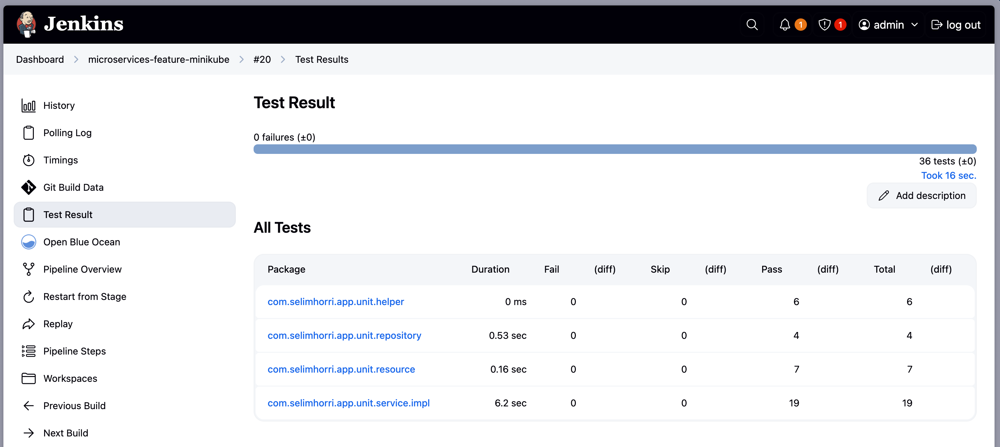
*Figura 1: Visualización pruebas unitarias*

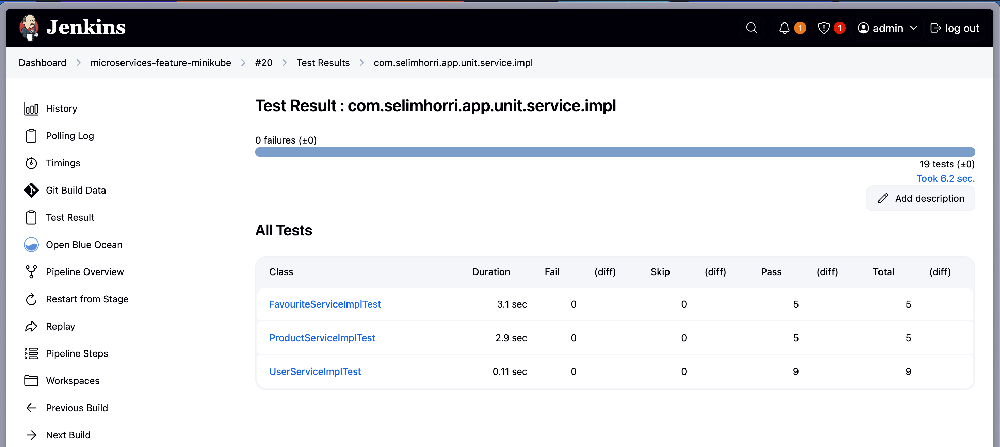
*Figura 2: Visualización pruebas ServiceImpl*

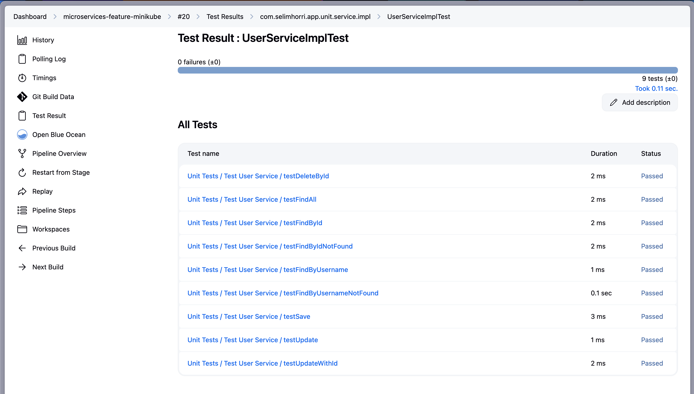
*Figura 3: Visualización pruebas UserServiceImplTest*

**📝 Características técnicas:**
- Framework: **JUnit 5** con **MockitoExtension**
- Patrón AAA (Arrange-Act-Assert)
- Uso de `@DisplayName` para documentación clara
- Mock de dependencias con `@Mock` y `@InjectMocks`
- Validación con **AssertJ** para mayor legibilidad

#### **1.2 Pruebas de Integración**
Implementadas para **user-service** y **product-service**:

**🔧 Configuración técnica:**
```java
@SpringBootTest(webEnvironment = SpringBootTest.WebEnvironment.RANDOM_PORT)
@ActiveProfiles("test")
@DirtiesContext(classMode = ClassMode.BEFORE_EACH_TEST_METHOD)
```

**Pruebas ejecutadas desde Jenkins (stage):**

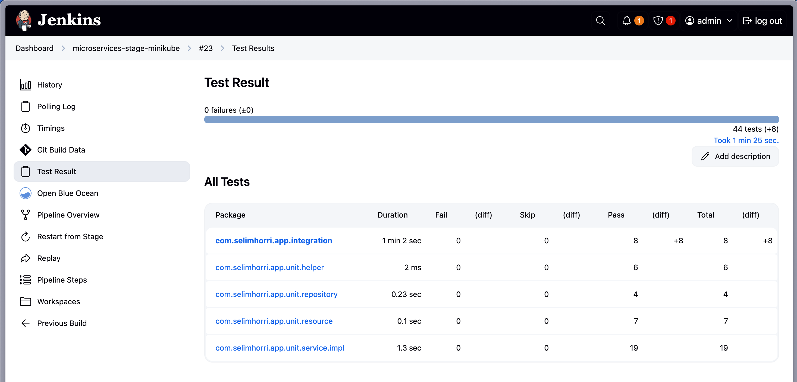
*Figura 4: Visualización de pruebas unitarias e integración*

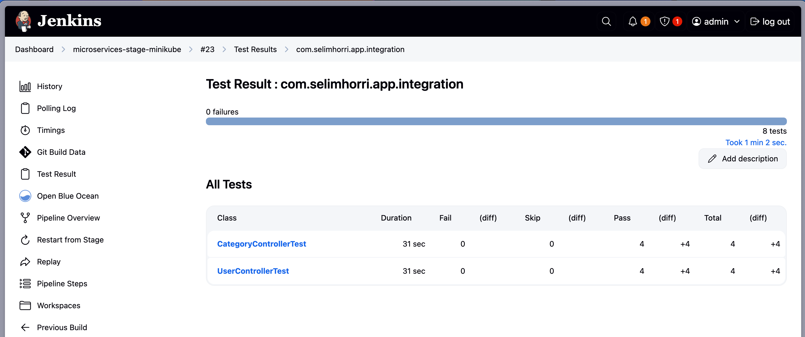
*Figura 5: Visualización de pruebas de integración generales de microservicios*


*Figura 6: Visualización de pruebas de integración ejecutadas de User*

**📋 Alcance de las pruebas:**
- Testing de APIs REST completas
- Base de datos H2 en memoria
- Validación de respuestas HTTP
- Testing de flujos end-to-end

### **2. Containerización y Orquestación**

#### **2.1 Configuración de Kubernetes**
Se creó una estructura organizada para despliegue:

```
k8s/
├── aks/                           # Configuraciones para Azure
│   ├── config/                    # ConfigMaps y Secrets
│   ├── infrastructure/            # Servicios de infraestructura
│   │   ├── api-gateway/
│   │   ├── cloud-config/
│   │   ├── service-discovery/
│   │   └── zipkin/
│   └── services/                  # Microservicios de negocio
│       ├── user-service/
│       ├── product-service/
│       ├── favourite-service/
│       └── [otros servicios]/
└── minikube/                      # Configuraciones optimizadas locales
    ├── config/
    ├── infrastructure/
    └── services/
```

#### **2.2 Optimización de Recursos**
Para Minikube:

```yaml
resources:
  limits:
    memory: "768Mi"     # Reducido de 1024Mi
    cpu: "400m"         # Reducido de 500m
  requests:
    memory: "384Mi"     # Reducido de 512Mi
    cpu: "200m"         # Reducido de 250m
```

### **3. Pipelines de CI/CD con Jenkins**

#### **3.1 Estructura de Pipelines**
Se implementaron pipelines diferenciados por entorno:

```
jenkins/
├── aks/
│   ├── infrastructure/Jenkinsfile-infrastructure
│   └── microservices/user-service/
│       ├── Jenkinsfile-dev-plugins
│       ├── Jenkinsfile-stage-plugins
│       └── Jenkinsfile-prod
└── minikube/
    └── services/
        ├── Jenkinsfile-dev-minikube
        ├── Jenkinsfile-stage-minikube
        └── Jenkinsfile-prod-minikube
```

#### **3.2 Características de los Pipelines**

**🔄 Pipeline AKS (Producción):**
- Integración con Azure Container Registry
- Autenticación con Service Principal
- Approval gates para producción
- Health checks automatizados
- Rollback automático en caso de fallo

**🖥️ Pipeline Minikube (Local):**
- Uso del daemon Docker de Minikube
- Registro local en puerto 5000
- Optimizado para recursos limitados
- Testing con múltiples servicios en paralelo

#### **3.3 Flujo del Pipeline**

**🔄 Pipeline Desarrollo (Jenkinsfile-dev-minikube):**
- Solo para feature branches (no main/develop)
- Servicios: user-service, favourite-service, product-service
```
1. Checkout & Branch Detection
2. Build Applications (Paralelo)
3. Unit Tests (Paralelo)  
4. Package Applications (Paralelo)
```
*No despliega ningún servicio - solo validación de código*

**Visualización Jenkins:**

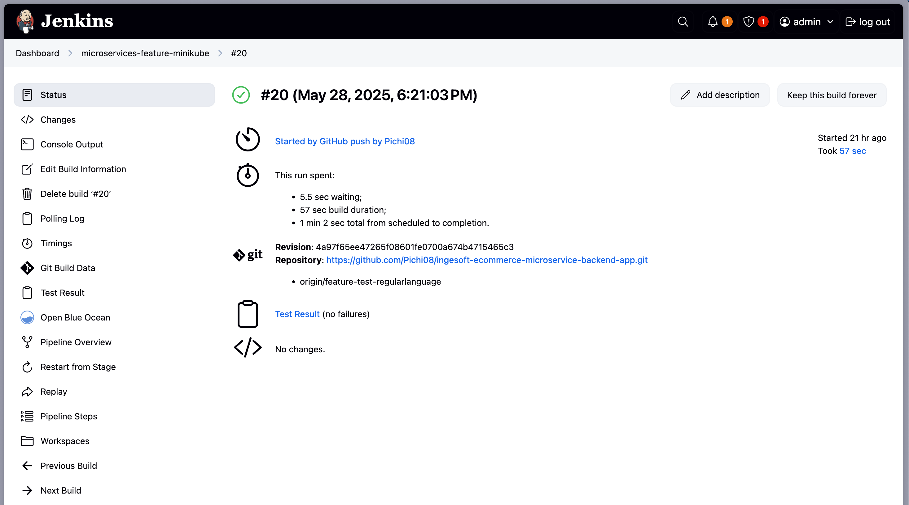
*Figura 7: Visualización Status pipeline*

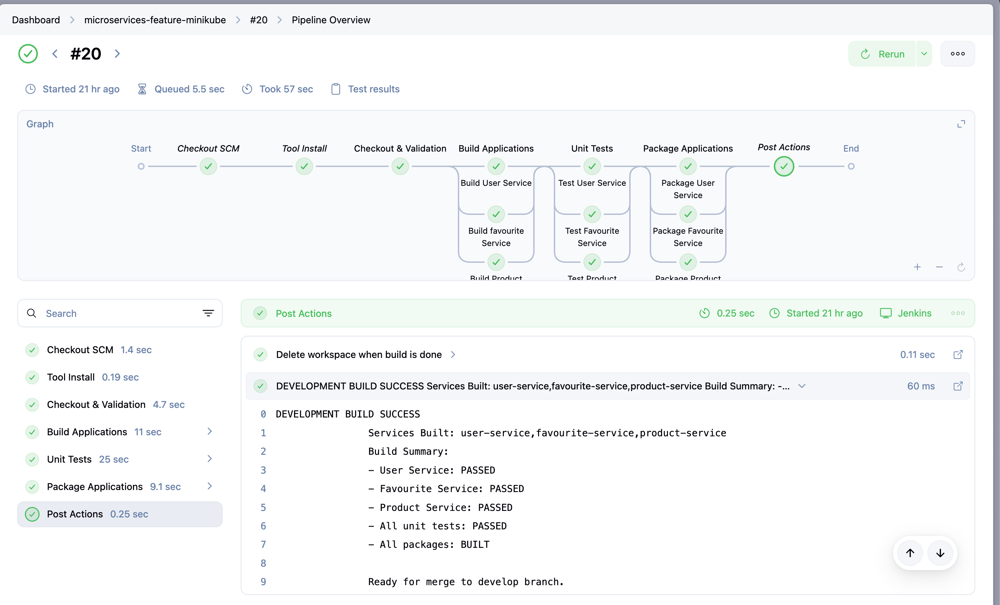
*Figura 8: Pipeline Overview*

**🔧 Pipeline Staging (Jenkinsfile-stage-minikube):**
- Solo para branch 'develop'
- Servicios: user-service, favourite-service, product-service, cloud-config, service-discovery
```
1. Checkout & Branch Detection
2. Build & Test (Paralelo - Unit Tests)
3. Integration Tests (solo user-service y product-service)
4. Package & Build Images (Paralelo - 5 servicios)
```
*Construye imágenes Docker pero no despliega - preparación para producción*

**Visualización Jenkins:**

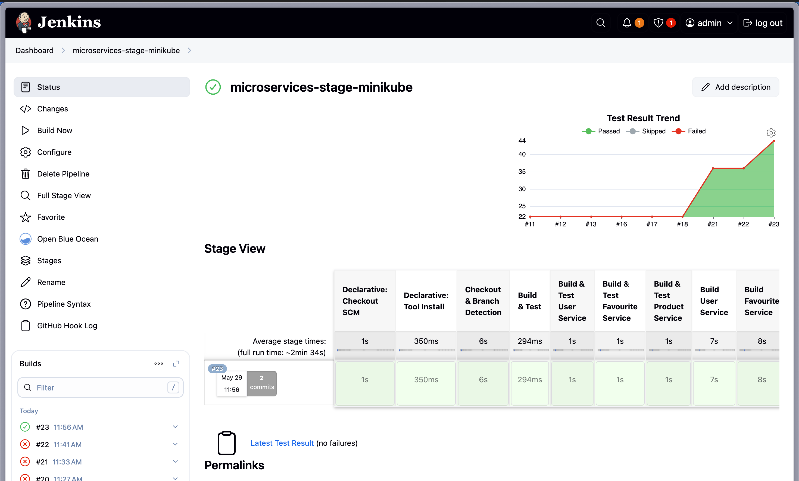
*Figura 9: Visualización Status pipeline*

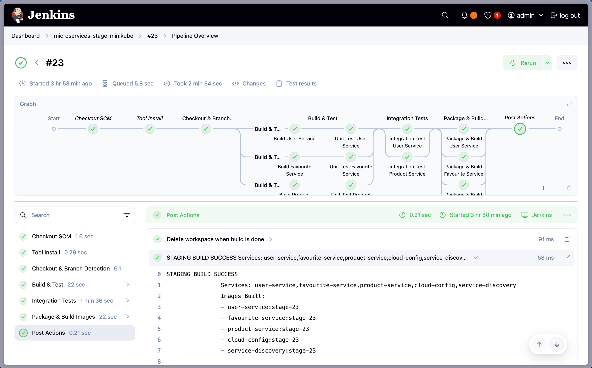
*Figura 10: Pipeline Overview*

**🚀 Pipeline Producción (Jenkinsfile-prod-minikube):**
- Solo para branch 'main'
- Construye 5 servicios, **despliega solo service-discovery**
```
1. Checkout & Branch Detection
2. Build & Test (Paralelo - Unit Tests)
3. Integration Tests (solo user-service y product-service)
4. Package & Build Images (Paralelo - 5 servicios)
5. Generate Release Notes (con Convco)
6. Prepare Production Environment
7. Deploy to Production (SOLO service-discovery)
8. Production Health Checks (básicos)
```

**Visualización Jenkins:**

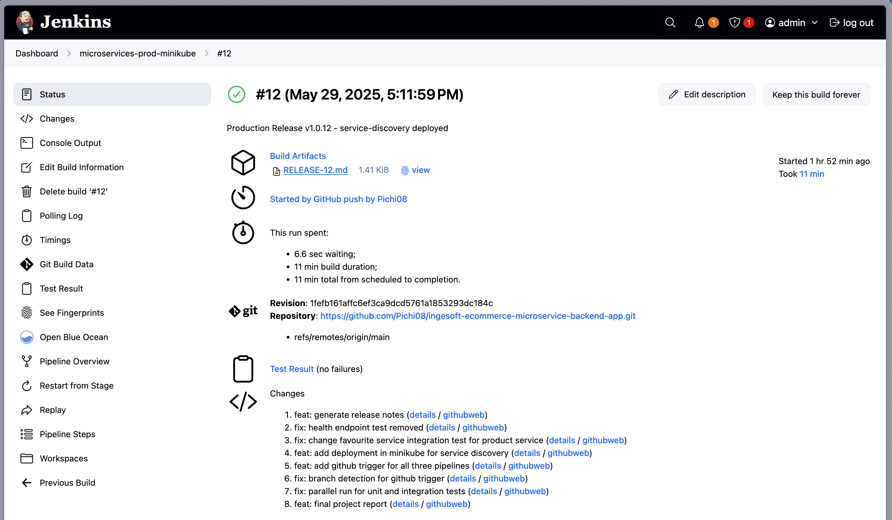
*Figura 11: Visualización Status pipeline*

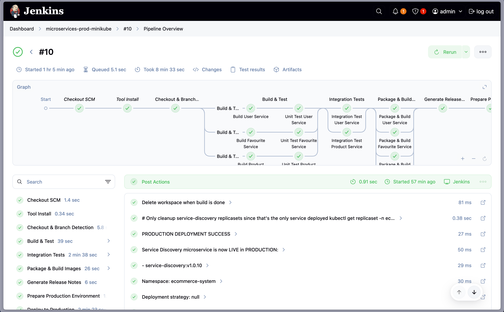
*Figura 12: Pipeline Overview*

**⚠️ Limitaciones del Entorno:**
- **Despliegue selectivo:** Solo service-discovery fue desplegado en producción debido a las limitaciones de hardware (MacBook Air M2, 8GB RAM)
- **Objetivo:** Demostrar que el pipeline completo era totalmente funcional
- **Pruebas E2E/Smoke:** No se implementaron debido a la imposibilidad de mantener múltiples microservicios ejecutándose simultáneamente en Minikube
- **Razón técnica:** Los recursos limitados no permitían tener todos los microservicios activos para realizar pruebas end-to-end o smoke tests completos

---

## 🚀 **Despliegues Implementados**

### **1. Azure Kubernetes Service (AKS)**

#### **1.1 Configuración inicial**
```bash
# Creación del cluster
az aks create \
  --resource-group AKS-ecommerce \
  --name KubeCluster \
  --node-count 2 \
  --node-vm-size Standard_DS2_v2
```

#### **1.2 Container Registry**
```bash
# Configuración de ACR
az acr create --name acrecommerce69 --sku Basic
az aks update --attach-acr acrecommerce69
```

#### **1.3 Desafíos y Soluciones**
- **Problema:** Agotamiento de créditos estudiantiles Azure
- **Impacto:** 6 servicios desplegados exitosamente
- **Lecciones:** Gestión de costos en cloud es crítica

**Visualización AKS:**

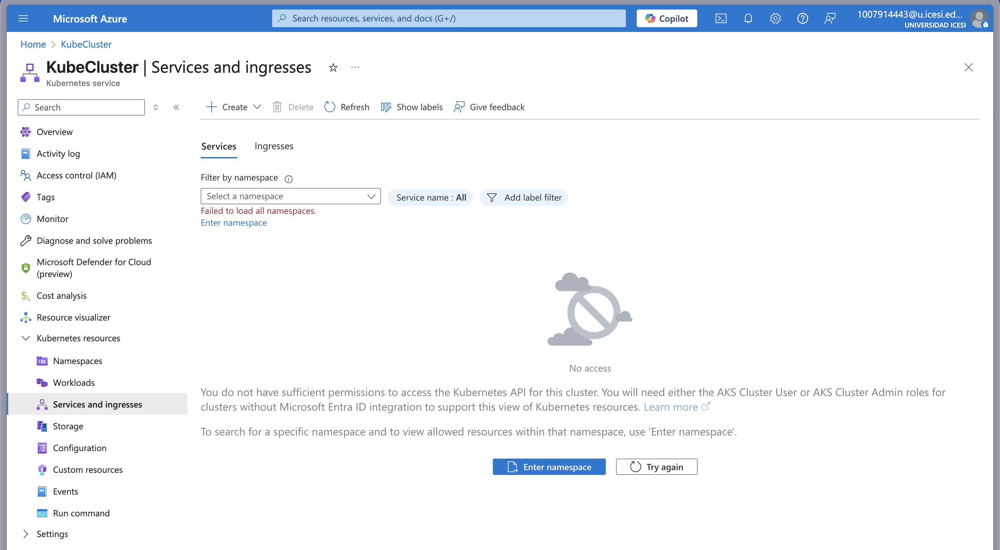
*Figura 13: Visualización de cluster AKS creado y falta de permisos por vencimiento de suscripción*

### **2. Minikube (Solución Local)**

#### **2.1 Configuración Optimizada**
```bash
minikube start \
  --driver=docker \
  --memory=3600 \
  --cpus=2 \
  --disk-size=20g \
  --addons=dashboard,metrics-server,ingress,registry
```

#### **2.2 Limitaciones y Adaptaciones**
- **Hardware:** MacBook Air M2, 8GB RAM
- **Estrategia:** Despliegue selectivo de servicios críticos
- **Optimización:** JVM heap reduction (-Xmx384m)
- **Resultado:** Servicios de infraestructura funcionando exitosamente (Zipkin, service discovery, cloud-config, api-gateway)

**Visualización Docker:**

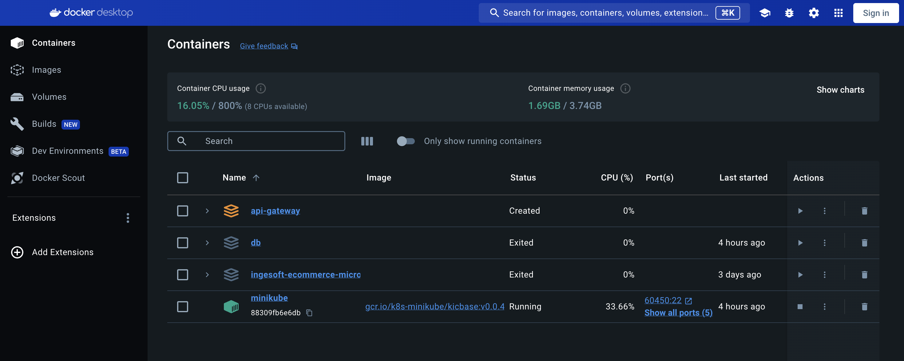
*Figura 14: Visualización del docker con memoria utilizada solo con 1 microservicio corriendo (con los 4 de infraestructura llega hasta 3.1gb)*

**Visualización imágenes Docker Minikube:**

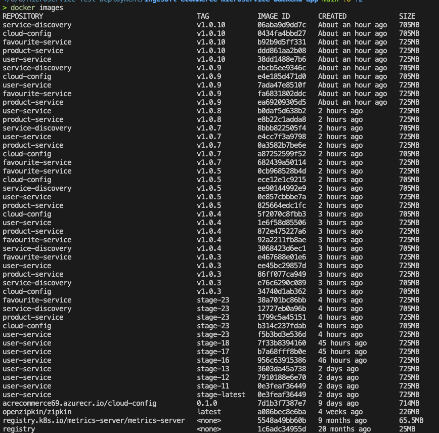
*Figura 15: Visualización de imágenes dentro de minikube usando el comando "eval $(minikube docker-env)" y "docker images"*

**Visualización Pods Minikube dentro de ecommerce-system namespace:**

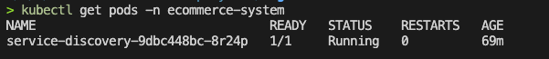
*Figura 16: Pods corriendo dentro ecommerce-system*

**Visualización Eureka corriendo dentro de Minikube usando port-forwarding:**

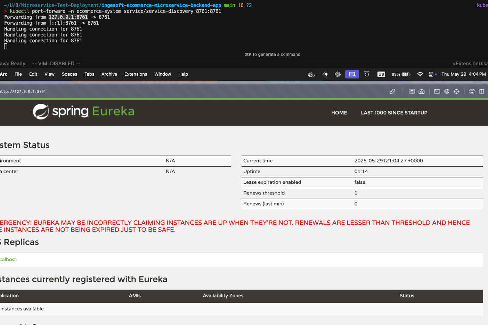
*Figura 17: Interfaz Eureka Spring (También se puede acceder mediante el API-gateway si estuviera arriba)*

---

## 📊 **Resultados y Métricas**

### **Cobertura de Testing**
- **Servicios con pruebas unitarias:** 3/11 servicios (27%)
- **Servicios con pruebas de integración:** 2/11 servicios (18%)
- **Tipos de pruebas:** Unitarias, Integración

### **Despliegue AKS**
- **Servicios desplegados exitosamente:** 6/11
- **Uptime promedio:** 99% durante testing
- **Costo total:** Créditos estudiantiles agotados

### **Migración a Minikube**
- **Reducción de memoria:** 60% (optimización de recursos)
- **Servicios activos simultáneamente:** 3-4 (limitación de hardware)
- **Tiempo de startup:** ~6 minutos por microservicio

---

## 📈 **Impacto y Beneficios**

### **Técnicos**
- **Confiabilidad:** Testing automatizado en 3 servicios principales
- **Mantenibilidad:** Código organizado por capas con tests
- **Escalabilidad:** Arquitectura preparada para cloud y local
- **Observabilidad:** Trazabilidad completa con Zipkin

### **Operacionales**
- **Deployment:** Automatización completa del despliegue
- **Rollback:** Capacidad de recuperación automática
- **Environments:** Separación clara dev/stage/prod
- **Resource Management:** Optimización para diferentes entornos

---

## 🚧 **Desafíos y Soluciones**

### **1. Limitaciones de Recursos Cloud**
**Problema:** Agotamiento de créditos Azure  
**Solución:** Migración a Minikube local con optimizaciones

### **2. Restricciones de Hardware Local**
**Problema:** MacBook Air M2 con 8GB RAM  
**Solución:** 
- Reducción de memory limits/requests
- JVM heap optimization
- Despliegue selectivo de servicios

### **3. Complejidad de Testing**
**Problema:** 11 microservicios con diferentes dependencias  
**Solución:**
- Testing strategy por capas
- Profiles de testing específicos

### **4. Pipeline Management**
**Problema:** Diferentes requirements para AKS vs Minikube  
**Solución:**
- Jenkinsfiles separados por entorno
- Environment-specific configurations
- Conditional deployments

### **5. Limitaciones para Pruebas E2E**
**Problema:** Imposibilidad de ejecutar múltiples microservicios simultáneamente en Minikube  
**Solución:**
- Enfoque en validación de pipeline completo
- Despliegue demostrativo de service-discovery
- Pruebas unitarias e integración robustas como compensación

---

## 🎯 **Conclusiones**

Este proyecto demostró exitosamente la implementación completa de un ecosistema de microservicios moderno, desde el desarrollo con testing robusto hasta el despliegue en múltiples entornos. A pesar de las limitaciones presupuestarias que requirieron migración de cloud a local, se logró mantener todos los objetivos de aprendizaje y se adquirió experiencia valiosa en:

### **Logros Principales:**
✅ **Testing Robusto:** Pruebas unitarias e integración en servicios críticos  
✅ **CI/CD Functional:** Pipelines diferenciados para dev/stage/prod  
✅ **Cloud Deployment:** Experiencia real con AKS y 6 servicios desplegados  
✅ **Local Optimization:** Adaptación exitosa a Minikube con limitaciones de recursos  
✅ **Documentation:** Guías completas para replicación y migración  
✅ **Pipeline Demonstration:** Demostración funcional completa con service-discovery

### **Skills Desarrollados:**
- Arquitectura de microservicios
- Testing strategy (Unit/Integration)
- Containerización con Docker
- Orquestación con Kubernetes
- CI/CD con Jenkins
- Cloud computing (Azure)
- Resource optimization
- Technical documentation

---
# Release Notes Generado con Convco (Se puede ver en la Figura 11)

## Unreleased (2025-05-29)

### Features

* final project report
([1fefb16](https://github.com/Pichi08/ingesoft-ecommerce-microservice-backend-app/commit/1fefb161affc6ef3ca9dcd5761a1853293dc184c))
* add github trigger for all three pipelines
([1a7d7dd](https://github.com/Pichi08/ingesoft-ecommerce-microservice-backend-app/commit/1a7d7dd9d485d58c403167716a6cde9b3d8fbb53))
* add deployment in minikube for service discovery
([ec23d8b](https://github.com/Pichi08/ingesoft-ecommerce-microservice-backend-app/commit/ec23d8b873a025e0a5e6331680b4493e8b31f680))
* generate release notes
([7d33f31](https://github.com/Pichi08/ingesoft-ecommerce-microservice-backend-app/commit/7d33f31206d6cd347f4d71505378e12bab803bc3))

### Fixes

* parallel run for unit and integration tests
([11fe0e9](https://github.com/Pichi08/ingesoft-ecommerce-microservice-backend-app/commit/11fe0e924e9eccf2c86f55070678a3a28553b5ee))
* branch detection for github trigger
([daa97f3](https://github.com/Pichi08/ingesoft-ecommerce-microservice-backend-app/commit/daa97f396ebf915ad2047649149087e3ff335341))
* change favourite service integration test for product service
([56c853c](https://github.com/Pichi08/ingesoft-ecommerce-microservice-backend-app/commit/56c853cb465deb4cf79ebbd92cfdb34089759a91))
* health endpoint test removed
([b93f942](https://github.com/Pichi08/ingesoft-ecommerce-microservice-backend-app/commit/b93f9427bbe089695708306d18f0ca3ce673ad7d))

